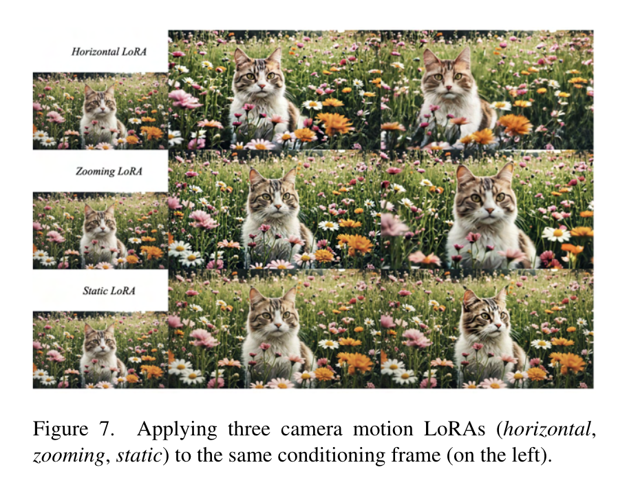
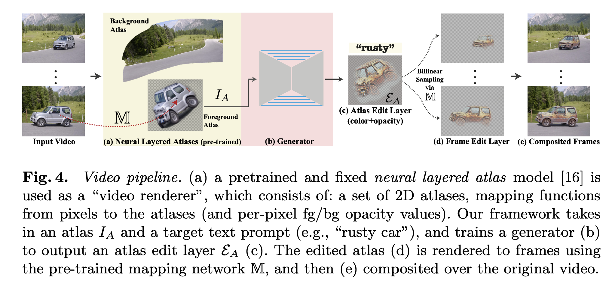

# 2023.11

## text-to-video

[Pika 1.0 | Pika](https://pika.art/blog): 
text-to-video, video style translation, image-to-video, image/video expanding, video extending, video editing.

No open-source model and API now. 

Their demo is processed in realtime, which is astounding by now.

[PixelDance | ByteDance](https://makepixelsdance.github.io/): 
- basic mode: (1 image + text) to video
- magic mode: (2 images + text) to video

The generated results are highly dynamic compared to other models. It uses [WebVid-10M](https://github.com/m-bain/webvid) from [this paper](https://arxiv.org/abs/2104.00650.pdf) to train the models. WebVid-10M is a dataset consisting of 10M `<caption, video>` pairs, where the weak captions are scraped from the Internet. Besides, the contributions of the original paper which collects the dataset focus on the video-text joint embedding and video-text retrieval (some sort of alignment).

Expected to release its API in 2-3 months.

机器之心's article: https://www.jiqizhixin.com/articles/2023-11-24-7

[Stable Video Diffusion | Stability.AI](https://stability.ai/news/stable-video-diffusion-open-ai-video-model):
paper [here](https://stability.ai/research/stable-video-diffusion-scaling-latent-video-diffusion-models-to-large-datasets).

text-to-video, image-to-video, and multiview synthesis via image-to-video finetuning.

Open-source model: https://github.com/Stability-AI/generative-models

[Gen-2 | Runway](https://research.runwayml.com/gen2): similar functions, but demos are not very dynamic.

__Motion Brush__: the most exciting thing about Gen-2 is "motion brush". demo here: https://academy.runwayml.com/gen2/gen2-motion-brush. The accurate control on generated results is unprecedented.

[Text2LIVE | weizmannscience](https://github.com/omerbt/Text2LIVE):

ECCV2022 Oral.

## text-to-image

[clipdrop | Stability.AI](https://stability.ai/news/stability-ai-sdxl-turbo): extraordinary quality and speed! You can try the [demo](https://clipdrop.co/stable-diffusion-turbo) and the output is generated realtime without obvious delay.

Besides, I guess the algorithm considers the historical outputs in one web session to keep the variance low (i.e. they don't vary much if I change my text by just one or two words). For example, I gave the model the same text prompt `a bird flying in the forest` in different web sessions, and the first time the bird is flying toward the left, but the second time it is toward the right side. So I believe different web sessions are independent (maybe different seeds or different historical records?), while queries in one session are not.

weights for non-commercial use: https://huggingface.co/stabilityai/sdxl-turbo

paper: https://stability.ai/research/adversarial-diffusion-distillation