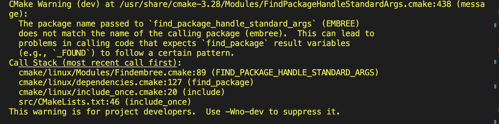

最近研究3DGS，打算看下渲染效果，一个个跑 render 函数太麻烦，于是想着用官方的 viewer 吧。但是官方的 viewer 只提供 Windows 环境下的 binary，Linux 平台上都得自己编译。官方命令是针对 Ubuntu22.04 的，但是在 Ubuntu20.04 上也能正常跑，命令长这样：

```bash
# Dependencies
sudo apt install -y libglew-dev libassimp-dev libboost-all-dev libgtk-3-dev libopencv-dev libglfw3-dev libavdevice-dev libavcodec-dev libeigen3-dev libxxf86vm-dev libembree-dev
# Project setup
cd SIBR_viewers
cmake -Bbuild . -DCMAKE_BUILD_TYPE=Release # add -G Ninja to build faster
cmake --build build -j24 --target install
```

下面的三条解释来自 ChatGPT，我觉得讲的很好，所以直接照搬过来了：

1. 命令 `cmake -Bbuild . -DCMAKE_BUILD_TYPE=Release -G Ninja` 用于在使用 Ninja 构建系统的情况下生成 Release 类型的构建。
具体而言，-Bbuild 指定了生成的构建系统文件存放的目录为 build。`.` 表示当前目录，告诉 CMake 在当前目录中查找 CMakeLists.txt 文件。
`-DCMAKE_BUILD_TYPE=Release` 是一个 CMake 变量设置选项，用于指定构建类型为 Release，即生成优化的、用于生产环境的构建产物。（作者内心：这说明其他的设置选项都可以通过 -D 来传入）
-G Ninja 指定了生成的构建系统为 Ninja。Ninja 是一个快速的构建系统，与传统的 Makefile 构建系统相比，它在构建过程中具有更低的开销和更好的并行性能。
因此，cmake -Bbuild . -DCMAKE_BUILD_TYPE=Release -G Ninja 的结果是在 build 目录中生成一个使用 Ninja 构建系统的 Release 类型的构建系统文件。在该构建系统下，可以使用 Ninja 工具执行构建操作，按照指定的配置和 CMakeLists.txt 文件中的指令生成构建产物。

2. 命令 `cmake --build build -j24 --target install` 用于使用构建系统进行构建和安装。
具体而言，--build build 指示 CMake 使用构建目录为 build 中的构建系统文件执行构建操作。
-j24 是一个选项，用于指定并行构建的线程数。在这里，-j24 表示同时使用 24 个线程进行构建，以加快构建速度。你可以根据系统的 CPU 核心数和可用资源来调整此选项。
--target install 指定了要构建和安装的目标。在 CMakeLists.txt 文件中，你可以使用 install() 命令来定义安装规则，指定要安装的文件或目标。--target install 告诉 CMake 只构建和安装与 install 目标关联的内容。
因此，cmake --build build -j24 --target install 的作用是在 build 目录中使用构建系统进行构建，并只构建和安装与 install 目标关联的内容。构建系统会根据项目的配置和 CMakeLists.txt 文件中的指令生成构建产物，并将其安装到指定的位置，如系统目录或自定义的安装目录。
这个命令通常在构建完成后进行构建产物的安装操作，以将构建得到的文件正确部署到目标位置，使其可供使用或分发。


3. 什么是构建系统文件？
构建系统文件是由 CMake 生成的用于构建项目的配置文件。这些文件描述了如何编译、链接和安装源代码以生成可执行文件、库文件和其他构建产物。
CMake 本身并不直接编译源代码，而是根据项目的配置和指令生成构建系统文件，然后使用适当的构建工具（如 make、Ninja、Visual Studio 等）来实际执行构建操作。
常见的构建系统文件包括：
- Makefiles：这是用于构建和管理项目的文件，通常由 GNU Make 或类似工具使用。Makefiles 包含了构建规则、依赖关系和编译选项，以及执行构建操作所需的命令。
- Visual Studio 项目文件：对于 Windows 平台上的项目，CMake 可以生成 Visual Studio 解决方案文件（.sln）和项目文件（.vcxproj）。这些文件包含了项目的配置、源文件列表、编译选项等信息，可以在 Visual Studio 中打开和构建项目。
- Ninja 构建文件：Ninja 是一个快速的构建系统，CMake 可以生成用于 Ninja 构建系统的构建文件（通常是一个名为 build.ninja 的文件）。Ninja 构建文件描述了构建规则和依赖关系，可以通过 Ninja 工具执行构建。
生成的构建系统文件根据项目的特定需求和配置，以及使用的构建工具而有所不同。它们负责将源代码编译为可执行文件、库文件或其他构建产物，并执行构建过程中的各种操作，如编译、链接、生成依赖关系、安装等。
构建系统文件的生成是 CMake 的核心功能之一，它使得跨平台的构建和项目管理变得更加简单和灵活。

在执行第一条 `cmake` 构建命令时，出现报错：

```bash
-- ****************************************************************


-- Adding dataset_tools project
-- BUILD_IBR_DATASET_TOOLS is OFF
-- Adding ulr project
-- BUILD_IBR_ULR is OFF
-- Adding basic project
-- BUILD_IBR_BASIC is ON
-- Adding gaussianviewer project
-- BUILD_IBR_GAUSSIANVIEWER is ON
-- Library CudaRasterizer already available, skipping.
-- The CUDA compiler identification is unknown
CMake Error at /usr/share/cmake-3.28/Modules/CMakeDetermineCUDACompiler.cmake:270 (message):
  Failed to detect a default CUDA architecture.

  Compiler output:

Call Stack (most recent call first):
  extlibs/CudaRasterizer/CudaRasterizer/CMakeLists.txt:14 (project)
```

发现无法找到默认 CUDA architecture （也就是sm_80, sm_75那些东西）。定位到报错处：

```cmake
# If the user did not set CMAKE_CUDA_ARCHITECTURES, use the compiler's default.
if("${CMAKE_CUDA_ARCHITECTURES}" STREQUAL "")
  cmake_policy(GET CMP0104 _CUDA_CMP0104)
  if(NOT CMAKE_CUDA_COMPILER_ID STREQUAL "NVIDIA" OR _CUDA_CMP0104 STREQUAL "NEW")
    set(CMAKE_CUDA_ARCHITECTURES "${CMAKE_CUDA_ARCHITECTURES_DEFAULT}" CACHE STRING "CUDA architectures")
    if(NOT CMAKE_CUDA_ARCHITECTURES)
      message(FATAL_ERROR "Failed to detect a default CUDA architecture.\n\nCompiler output:\n${CMAKE_CUDA_COMPILER_PRODUCED_OUTPUT}")
    endif()
  endif()
endif()
unset(CMAKE_CUDA_ARCHITECTURES_DEFAULT)
```

通过注释发现，我没有设置 `CMAKE_CUDA_ARCHITECTURES`，并且 compiler's default 也找不到，那最简单的解决办法就是根据当前 GPU 的 architecture 自己设置一下。这里我没有研究为什么 compiler's default 找不到架构名称，仅在此记录怎么解决报错。

注意，如果上次cmake出错，再次运行相同命令前最好将 build 文件夹删除，否则可能出现一些奇怪的问题（如果你不删除 build 文件夹，也可以直接在 build 文件夹下的 CMakeCache.txt 中修改对应的参数）。

删除后，运行：

```bash
cmake -Bbuild . -DCMAKE_BUILD_TYPE=Release -DCMAKE_CUDA_ARCHITECTURES=80 -G Ninja
```

此时出现新的报错：

```bash
CMake Error at extlibs/CudaRasterizer/CudaRasterizer/CMakeLists.txt:14 (project):
  No CMAKE_CUDA_COMPILER could be found.

  Tell CMake where to find the compiler by setting either the environment
  variable "CUDACXX" or the CMake cache entry CMAKE_CUDA_COMPILER to the full
  path to the compiler, or to the compiler name if it is in the PATH.
```

这时解决方案已经很明显了，要么设置 CUDACXX 的环境变量，要么添加 CMAKE_CUDA_COMPILER 参数。

再次删除 build 文件夹，运行：

```bash
cmake -Bbuild . -DCMAKE_BUILD_TYPE=Release -DCMAKE_CUDA_ARCHITECTURES=80 -DCMAKE_CUDA_COMPILER=/usr/local/cuda/bin/nvcc -G Ninja
```

此时应该不会报错，只有一些 warnings。但是有一个 warning 还是需要注意一下：

```
CMake Warning at cmake/linux/dependencies.cmake:127 (find_package):
  By not providing "Findembree.cmake" in CMAKE_MODULE_PATH this project has
  asked CMake to find a package configuration file provided by "embree", but
  CMake did not find one.

  Could not find a package configuration file provided by "embree" (requested
  version 3.0) with any of the following names:

    embreeConfig.cmake
    embree-config.cmake

  Add the installation prefix of "embree" to CMAKE_PREFIX_PATH or set
  "embree_DIR" to a directory containing one of the above files.  If "embree"
  provides a separate development package or SDK, be sure it has been
  installed.
Call Stack (most recent call first):
  cmake/linux/include_once.cmake:20 (include)
  src/CMakeLists.txt:46 (include_once)
```

仔细看内容，它说我们没提供 `Findembree.cmake`，但是和 `./gaussian-splatting/SIBR_viewers/cmake/linux/Modules/FindEmbree.cmake` 仅有一个大小写的区别。将 `FindEmbree.cmake` 文件名改成 `Findembree.cmake` 即可消除该警告。

这番处理后还会有另一个警告：



定位到 Findembree.cmake 的 FindPackageHandleStandardArgs 处:

```cmake
INCLUDE(FindPackageHandleStandardArgs)
FIND_PACKAGE_HANDLE_STANDARD_ARGS(EMBREE
	REQUIRED_VARS EMBREE_INCLUDE_DIR EMBREE_LIBRARIES
	FAIL_MESSAGE "EMBREE wasn't found correctly. Set EMBREE_DIR to the root SDK installation directory."
)
```

将 EMBREE 改成 embree 即可消除该警告。

这时，cmake 已经将构建产物重新输出。我们需要运行 `cmake --build build -j24 --target install` 进行真正的编译、链接和安装。

首先是编译出错：找不到 `#include <opencv2/ximgproc/xxx.hpp>` 的头文件（xxx 具体内容我遗忘了）。说明找不到对应的头文件。也就是说，OpenCV2 库的地址要么没找到，要么是错误地址。

首先来打印一下 OpenCV2 的地址，在 dependencies.cmake 文件的第 270 行添加：

```cmake
message("OpenCV_INCLUDE_DIRS = " ${OpenCV_INCLUDE_DIRS})
```

打印发现是：`OpenCV_INCLUDE_DIRS = /usr/local/include/opencv4/`，去查看了这个文件夹确实有 opencv2，但是这里的 opencv2 并不全。可能是实验室之前的人装错了。而 `/usr/include/opencv4/` 下是正确的 opencv2，遂联系管理员删除该包。删除后，打印发现 `OpenCV_INCLUDE_DIRS = /usr/include/opencv4/`，编译错误也消失了。

但是现在出现了链接错误。具体错误如下：


```bash
[4/18] Linking CXX shared library src/core/raycaster/libsibr_raycaster.so
FAILED: src/core/raycaster/libsibr_raycaster.so 

---------- 省略一大堆输出内容 ------------

/usr/bin/ld: cannot find -lembree
collect2: error: ld returned 1 exit status

ninja: build stopped: subcommand failed.
```

首先，`-lembree` 会去默认 link directory 下寻找 libembree.so，但我们在 Findembree.cmake 打印 EMBREE_LIBRARY 变量，发现是 `/usr/lib/x86_64-linux-gnu/libembree3.so`，因此并没有 `/usr/lib/x86_64-linux-gnu/libembree.so` 存在。这时需要我们让 `-lembree` 改成 `-lembree3`，所以需要改 cmake 文件。

通过全局搜索 embree，发现 `SIBR_viewers/src/core/raycaster/CMakeLists.txt` 中有这样的语句：

```cmake
if(WIN32)
target_link_libraries(${PROJECT_NAME}
	OpenMP::OpenMP_CXX
	embree3
	sibr_graphics
	sibr_assets
	nanoflann
)
else()
target_link_libraries(${PROJECT_NAME}
	OpenMP::OpenMP_CXX
	embree
# CLUSTER
#	/data/graphdeco/share/tbb/lib64/libtbb.so
	sibr_graphics
	sibr_assets
	nanoflann
)
endif()
```

这里就是给 raycaster 添加 link library 的部分（记住使用的是 target_link_libraries 语句哦），将下面的 embree 改成 embree3 即可消除链接错误。

至此可以成功安装 SIBR viewer。但是，如果你的服务器是远程的，你大概率没法通过X11 forwarding等方法成功运行 SIBR viewer，建议把 ply 模型文件下载下来，用别的开源 viewer 查看渲染效果吧。这里推荐一个浏览器上的实现：[https://projects.markkellogg.org/threejs/demo_gaussian_splats_3d.php](https://projects.markkellogg.org/threejs/demo_gaussian_splats_3d.php)

